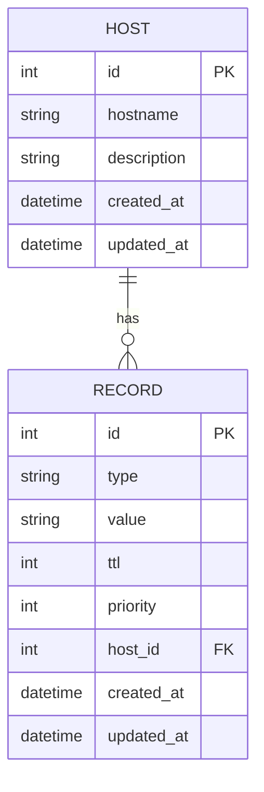

# Mini DNS API

A high-performance, asynchronous DNS record management API built with FastAPI and SQLModel. This API provides a simple yet powerful interface for managing DNS records programmatically, with support for various record types including A, AAAA, CNAME, and MX records.

## ✨ Features

- **RESTful API** for managing DNS records and hosts
- **Async-first** architecture with FastAPI
- **Type-safe** with Python type hints and Pydantic validation
- **Comprehensive test suite** with 90%+ test coverage
- **Containerized** with Docker for easy deployment
- **Production-ready** with proper error handling and logging
- **Rate limiting** and request validation
- **CNAME resolution** with loop detection
- **Record validation** with proper type checking

## 🚀 Quick Start

### Prerequisites

- Python 3.13 or higher
- pip (Python package manager)
- Git
- Docker (optional, for containerized deployment)

### Local Development Setup

1. **Clone the repository**:
   ```bash
   git clone git@github.com:rostysIav/mini-dns-api.git
   cd mini-dns-api
   ```

2. **Set up virtual environment**:
   ```bash
   # On Windows
   python -m venv .venv
   .venv\Scripts\activate
   
   # On macOS/Linux
   python3 -m venv .venv
   source .venv/bin/activate
   ```

3. **Install dependencies**:
   ```bash
   # Install project in development mode with all dependencies
   pip install -e ".[dev]"
   ```

### Running the Application

#### Development Server

```bash
uvicorn app.main:app --reload
```

The API will be available at `http://localhost:8000`

#### Using Docker

```bash
docker-compose up --build
```

## 📚 API Reference

### Base URL
All API endpoints are prefixed with `/api/v1`

### Authentication
This API currently doesn't require authentication for development purposes. In production, you should implement proper authentication.

### Endpoints

#### Hosts

- `GET /api/v1/hosts` - List all hosts
- `POST /api/v1/hosts` - Create a new host
- `GET /api/v1/hosts/{host_id}` - Get host details
- `PATCH /api/v1/hosts/{host_id}` - Update a host
- `DELETE /api/v1/hosts/{host_id}` - Delete a host

#### Records

- `GET /api/v1/records` - List all records
- `POST /api/v1/records` - Create a new record
- `GET /api/v1/records/{record_id}` - Get record details
- `PATCH /api/v1/records/{record_id}` - Update a record
- `DELETE /api/v1/records/{record_id}` - Delete a record

#### DNS Resolution

- `GET /api/v1/resolve/{hostname}` - Resolve a hostname to its records
- `GET /api/v1/cname-chain/{hostname}` - Get the full CNAME chain for a hostname

### Example Requests

#### Create a Host

```bash
curl -X 'POST' \
  'http://localhost:8000/api/v1/hosts' \
  -H 'Content-Type: application/json' \
  -d '{
    "hostname": "example.com",
    "description": "Example domain"
  }'
```

#### Create an A Record

```bash
curl -X 'POST' \
  'http://localhost:8000/api/v1/records' \
  -H 'Content-Type: application/json' \
  -d '{
    "type": "A",
    "value": "192.168.1.1",
    "ttl": 300,
    "host_id": 1
  }'
```

#### Resolve a Hostname

```bash
curl 'http://localhost:8000/api/v1/resolve/example.com?type=A'
```

## 🏗️ Architecture

### Tech Stack

- **Framework**: FastAPI
- **Database**: SQLite (development), PostgreSQL (production-ready)
- **ORM**: SQLModel (SQLAlchemy + Pydantic)
- **Testing**: pytest with coverage
- **Code Quality**: Black, isort, flake8, mypy
- **Containerization**: Docker

### Design Decisions

1. **Async Architecture**: Built with async/await for high concurrency
2. **Type Safety**: Comprehensive type hints and validation
3. **Modular Design**: Clear separation of concerns
4. **Testability**: Dependency injection for easy testing
5. **Scalability**: Designed to scale horizontally

### Data Model



## 🤖 AI Usage

This project was developed with the assistance of AI tools. Key areas where AI was utilized include:

1. **Code Generation**: Initial scaffolding of API endpoints and models
2. **Test Generation**: Creation of comprehensive test cases
3. **Documentation**: Assistance with README and inline documentation
4. **Code Review**: Suggestions for improvements and optimizations

## 📄 License

This project is licensed under the MIT License - see the [LICENSE](LICENSE) file for details.

## 🙏 Acknowledgments

- FastAPI for the awesome async framework
- SQLModel for combining SQLAlchemy and Pydantic
- The open-source community for endless inspiration
   
   # Install development dependencies
   pip install -r requirements-dev.txt
   ```

4. **Set up pre-commit hooks**:
   ```bash
   pre-commit install
   ```

### Running the Application

1. **Start the development server**:
   ```bash
   uvicorn app.main:app --reload
   ```
   - API documentation will be available at: http://localhost:8000/docs
   - Alternative documentation (ReDoc): http://localhost:8000/redoc

2. **Run tests**:
   ```bash
   # Run all tests
   pytest
   
   # Run tests with coverage report
   pytest --cov=app --cov-report=term-missing
   
   # Run a specific test file
   pytest tests/test_module.py -v
   ```

3. **Code Quality Checks**:
   ```bash
   # Format code with Black
   black .
   
   # Lint code with Ruff
   ruff check .
   
   # Type checking with mypy
   mypy .
   ```

### Managing Dependencies

- To add a new dependency:
  1. Add it to `requirements.in`
  2. Run `pip-compile requirements.in` to update `requirements.txt`
  3. Install with `pip install -r requirements.txt`

- To update all dependencies:
  ```bash
  pip-compile --upgrade
  pip install -r requirements.txt
  ```

### Environment Variables

Create a `.env` file in the root directory with the following variables:

```env
# Database
SQLALCHEMY_DATABASE_URI=sqlite:///./sql_app.db

# Application
PROJECT_NAME="Mini DNS API"
API_V1_STR=/api/v1
```

## Project Structure

```
mini-dns-api/
├── app/
│   ├── api/           # FastAPI routers
│   ├── models/        # SQLModel entities
│   ├── schemas/       # Pydantic models
│   ├── services/      # Business logic
│   ├── crud/          # Database operations
│   └── core/          # Application configuration
├── tests/             # Test files
├── .pre-commit-config.yaml
├── pyproject.toml
└── README.md
```

## Running Tests

```bash
pytest
```

## Code Quality

- Format code with Black:
  ```bash
  black .
  ```

- Lint code with Ruff:
  ```bash
  ruff check .
  ```

- Type checking with mypy:
  ```bash
  mypy .
  ```

## License

MIT
