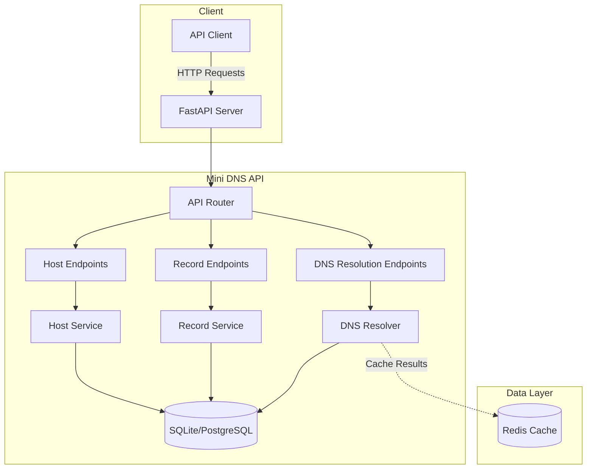

# Mini DNS API Architecture

## System Overview

## Components

### 1. API Layer
- **FastAPI Server**: Handles incoming HTTP requests and responses
- **API Router**: Routes requests to appropriate endpoints
- **Request Validation**: Validates incoming requests using Pydantic models
- **Response Models**: Formats responses according to OpenAPI specification

### 2. Service Layer
- **Host Service**: Manages host-related operations (CRUD)
- **Record Service**: Handles DNS record operations
- **DNS Resolver**: Resolves hostnames to their corresponding records

### 3. Data Layer
- **SQLite Database**: Used for development (can be replaced with PostgreSQL in production)
- **Redis Cache**: Caches DNS resolution results for better performance

## Data Flow

1. **Client** makes an HTTP request to the API
2. **FastAPI** receives and validates the request
3. **Router** directs the request to the appropriate endpoint
4. **Service** layer processes the business logic
5. **Database** operations are performed if needed
6. **Response** is formatted and returned to the client

## Security

- Input validation on all endpoints
- Rate limiting to prevent abuse
- CORS middleware for web client support
- Environment-based configuration

## Scalability

- Stateless design allows horizontal scaling
- Database connection pooling
- Asynchronous operations for better concurrency
